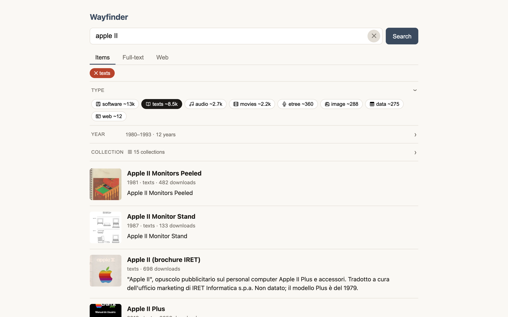
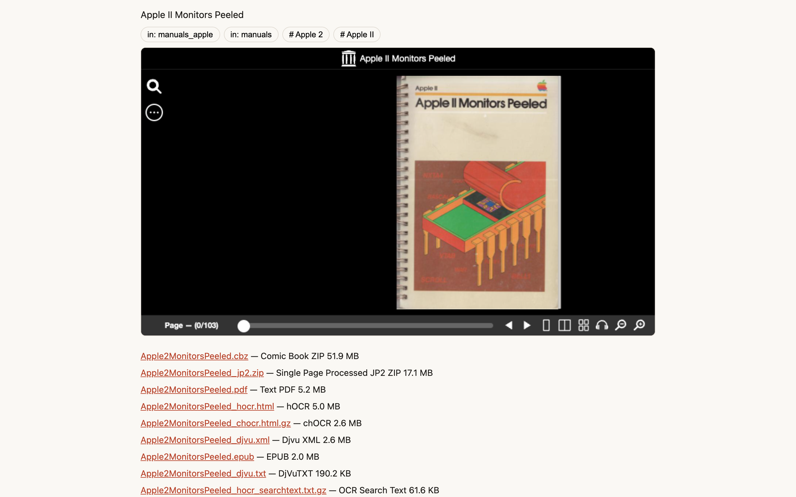
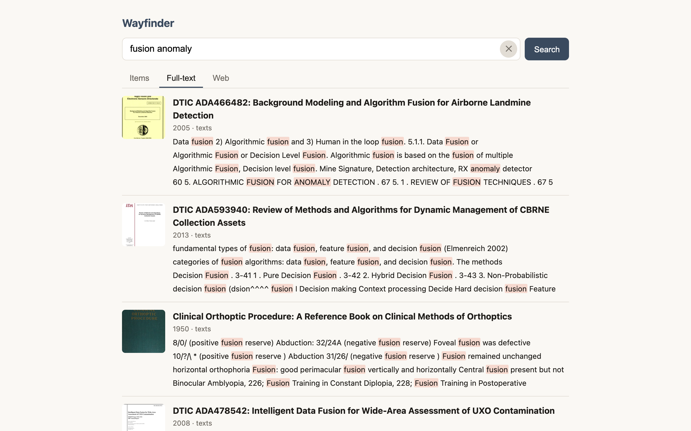
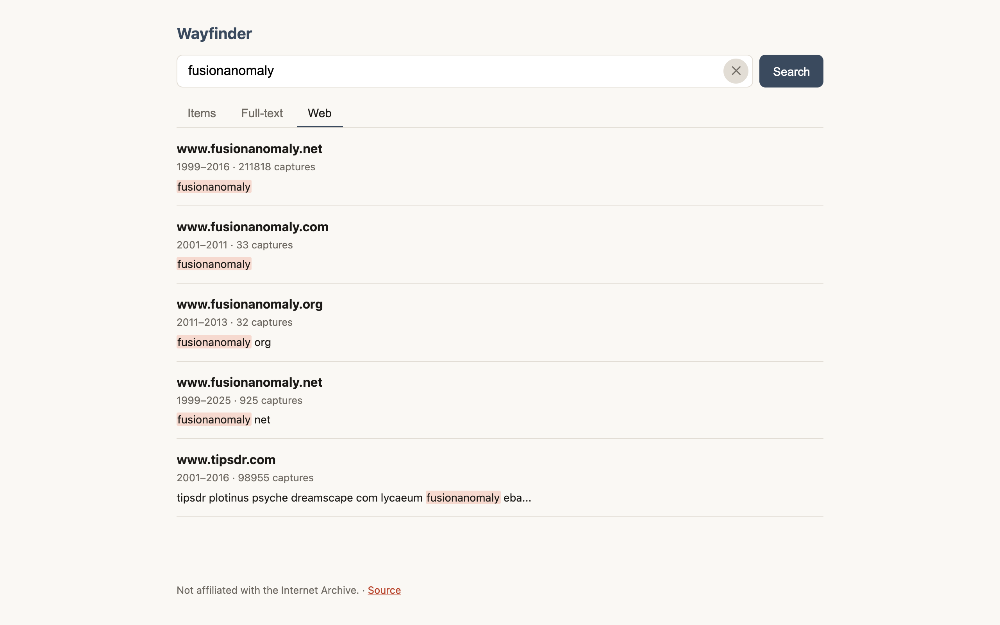

# Wayfinder

**Search the Internet Archive without fighting the site.** Full-text search
inside books and documents with page numbers, facet counts you can click,
direct download links, an inline viewer, and Wayback site search — one
query, three tabs.

*Not affiliated with the Internet Archive.*

## What it does

- **Items** — archive.org item search with Type / Year / Collection facet
  counts, an active-filter bar, and year-range inputs. Click a collection or
  subject chip in any expanded row to scope the search.
- **Full-text** — search *inside* the text of IA's books and documents;
  expand a hit to see matching snippets with page numbers.
- **Web** — Wayback Machine site-name matching with capture counts and
  first/last-seen years.
- **Expanded rows** — description, collection and subject chips, the
  embedded IA viewer (BookReader / player), direct download links for every
  file, and IA's own related items (which expand too).
- Keyboard-friendly rows, no accounts, no tracking, no build step.

## Try it

Live demo: **https://ia-search.quest** — rate-limited and shared, so please self-host for
real use. If it says it's busy, that's the demo protecting archive.org.

## Run it

    npm install
    npm start          # http://localhost:3000, or $PORT

Needs Node 22.12 or newer. Nothing else: a single Express process that
proxies archive.org and serves `public/`.

## Deploy

One Node service. Set `PORT` if your platform doesn't. Optional env:

| Env | Default | Meaning |
|---|---|---|
| `DEMO_MODE=1` | off | public-demo mode: per-client rate limit, global upstream budget, banner |
| `DEMO_CLIENT_PER_MINUTE` | 30 | requests per client IP per minute (demo mode) |
| `DEMO_GLOBAL_PER_MINUTE` | 120 | archive.org fetches per minute for the whole instance (demo mode) |
| `DEMO_STATS_INTERVAL_MS` | 300000 | demo mode: print one aggregate stats line (requests, upstream fetches, cache hits, 429s, 503s, active clients) to stdout per interval; 0 or non-numeric disables |
| `CACHE_TTL_MS` | 600000 (1800000 in demo) | response cache lifetime |

The demo logs only those aggregate counts — no per-request logs, no cookies, no third-party analytics.

It runs on Railway with the GitHub integration; `railway.json` skips
docs-only deploys.

Open Graph / Twitter previews point at https://ia-search.quest; change the
three absolute URLs in `public/index.html` if you self-host under your own
domain.

## How it works

The server is a thin proxy with a 10-minute in-memory cache: it exists so
the browser never talks to undocumented endpoints directly, and so repeat
queries are instant. Every upstream call retries once, then fails with a
clean per-tab error.

| Route | Backs onto | Returns |
|---|---|---|
| `GET /api/items?q&page&mediatype=a,b&yearFrom&yearTo&collection&subject` | `page_production` metadata backend | `{ total, returned, items, facets }` |
| `GET /api/fulltext?q&page` | `page_production` fts backend | `{ total, returned, hits }` |
| `GET /api/inside?id&q` | `fulltext/inside.php` on the item's server | `{ matches }` with page numbers |
| `GET /api/web?q` | `web.archive.org/__wb/search/anchor` | `{ sites }` |
| `GET /api/item/:id` | `archive.org/metadata/:id` | item detail incl. `collection[]`, `subject[]`, `files[]` (404 unknown) |
| `GET /api/related/:id` | `be-api.us.archive.org/mds/v1/get_related` | `{ items }` (≤ 6) |
| `GET /api/config` | — | `{ demo, repo }` |

**Caveat:** `page_production`, the Wayback anchor search and `be-api` are
undocumented endpoints that archive.org's own site uses. They can change or
disappear without notice. Each lives in its own `lib/` module and only takes
down its own tab (related items only their own section). Facet counts are
approximate by design of the upstream.

Be a good citizen: the User-Agent identifies this project, the cache keeps
repeat traffic off archive.org, and demo mode caps what one instance can
send. Please keep it that way if you fork.

## Tests

    npm test                 # unit tests against recorded fixtures
    node scripts/smoke.mjs   # live checks against archive.org (server must be running)
    npm run verify           # headless Chrome click-through (needs Google Chrome.app)
    npm run screenshots      # regenerate docs/screenshots/*.png

## License

MIT — see `LICENSE`.
